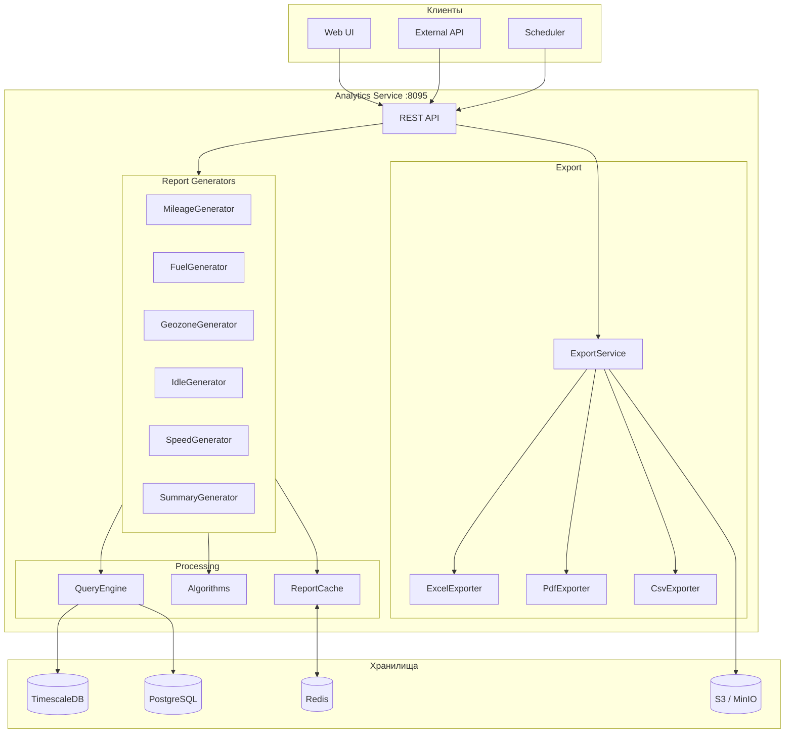
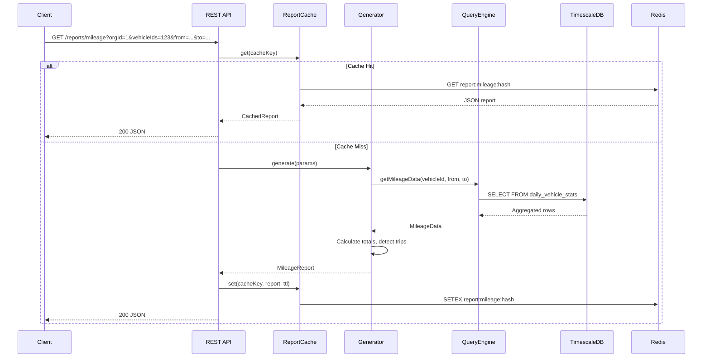

# 📊 Analytics Service — Архитектура

> Тег: `АКТУАЛЬНО` | Обновлён: `2026-03-01` | Версия: `1.0`

---

## Обзор

Сервис аналитики строит отчёты на основе GPS-данных из TimescaleDB и metadata из PostgreSQL. Архитектура разделена на слои: генераторы отчётов, алгоритмы, query engine, кеш и экспорт.

---

## Диаграмма потока данных



---

## Последовательность обработки запроса



---

## Компоненты

| Компонент | Пакет | Назначение |
|-----------|-------|------------|
| **ReportApi** | `api` | HTTP маршруты для отчётов |
| **ExportApi** | `api` | HTTP маршруты для экспорта |
| **ScheduledApi** | `api` | CRUD расписаний, ручной запуск |
| **MileageGenerator** | `generator` | Генерация отчёта по пробегу |
| **FuelGenerator** | `generator` | Генерация отчёта по топливу |
| **GeozoneGenerator** | `generator` | Генерация отчёта по геозонам |
| **IdleGenerator** | `generator` | Генерация отчёта по простою |
| **SpeedGenerator** | `generator` | Генерация отчёта по скорости |
| **SummaryGenerator** | `generator` | Сводный отчёт по организации |
| **QueryEngine** | `query` | Запросы к TimescaleDB/PostgreSQL |
| **MileageCalculator** | `algorithm` | Расчёт пробега (Haversine) |
| **TripDetector** | `algorithm` | Детектирование поездок |
| **FuelEventDetector** | `algorithm` | Детектирование заправок/сливов |
| **ReportCache** | `cache` | Redis кеширование отчётов |
| **ExportService** | `export` | Фоновый экспорт + S3 upload |
| **ExcelExporter** | `export` | Генерация .xlsx (Apache POI) |
| **PdfExporter** | `export` | Генерация .pdf (OpenPDF) |
| **CsvExporter** | `export` | Генерация .csv |
| **ReportScheduler** | `scheduler` | Запланированные отчёты (cron) |
| **ScheduledReportRepo** | `repository` | CRUD расписаний в PostgreSQL |
| **ReportHistoryRepo** | `repository` | История генераций |

---

## ZIO Layer граф

```
AppConfig.allLayers
  ├── TimescaleTransactor.live
  │     └── QueryEngine.live
  │           └── MileageGenerator.live
  │           └── FuelGenerator.live
  │           └── GeozoneGenerator.live
  │           └── IdleGenerator.live
  │           └── SpeedGenerator.live
  │           └── SummaryGenerator.live
  ├── PostgresTransactor.live
  │     └── ScheduledReportRepository.live
  │     └── ReportHistoryRepository.live
  ├── Redis
  │     └── ReportCache.live
  ├── S3Client
  │     └── ExportService.live
  │           └── ExcelExporter
  │           └── PdfExporter
  │           └── CsvExporter
  └── Server (port 8095)
```
