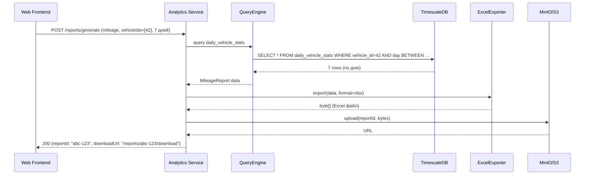

> Тег: `АКТУАЛЬНО` | Обновлён: `2026-03-02` | Версия: `1.0`

# 📖 Изучение Analytics Service

> Руководство по Analytics Service — сервису генерации отчётов и агрегации.

---

## 1. Назначение

**Analytics Service (AS)** — генерация 6 типов отчётов, экспорт в Excel/PDF/CSV, планировщик:
- Пробег (Mileage) — дистанция, маршруты, средняя скорость
- Топливо (Fuel) — расход, заправки, сливы
- Геозоны (Geozone) — время в геозонах, количество визитов
- Простои (Idle) — стоянки, время без движения
- Скорость (Speed) — нарушения скоростного режима
- Сводка (Summary) — общий отчёт за период

**Порт:** 8095. Не использует Kafka — читает из TimescaleDB + PostgreSQL.

---

## 2. Архитектура

```
REST API (ReportRoutes) → ReportGenerator(s) → QueryEngine → TimescaleDB
                       → ExportService → CsvExporter / ExcelExporter / PdfExporter → S3/MinIO
                       → ReportCache (Ref) — кэш готовых отчётов
ScheduledRoutes → ReportScheduler (cron4s) → автоматическая генерация по расписанию
```

### Компоненты

| Файл | Назначение |
|------|-----------|
| `generator/MileageReportGenerator.scala` | Пробег по дням / ТС |
| `generator/FuelReportGenerator.scala` | Расход топлива, заправки, сливы |
| `generator/GeozoneReportGenerator.scala` | Время в геозонах |
| `generator/IdleReportGenerator.scala` | Стоянки и простои |
| `generator/SpeedReportGenerator.scala` | Нарушения скорости |
| `generator/SummaryReportGenerator.scala` | Сводный отчёт |
| `algorithm/TripDetector.scala` | Определение рейсов из GPS |
| `algorithm/MileageCalculator.scala` | Расчёт пробега (Haversine) |
| `algorithm/FuelEventDetector.scala` | Заправки + сливы из данных датчиков |
| `query/QueryEngine.scala` | SQL запросы к TimescaleDB |
| `exporting/ExportService.scala` | Оркестрация экспорта |
| `exporting/ExcelExporter.scala` | Apache POI → .xlsx |
| `exporting/PdfExporter.scala` | OpenPDF → .pdf |
| `exporting/CsvExporter.scala` | CSV генерация |
| `cache/ReportCache.scala` | Кэш отчётов (Ref) |
| `scheduler/ReportScheduler.scala` | Cron планировщик (cron4s) |

---

## 3. Типы отчётов

```scala
enum ReportType:
  case Mileage   // Пробег за период
  case Fuel      // Расход / заправки / сливы
  case Geozone   // Время в геозонах
  case Idle      // Стоянки и простои
  case Speed     // Нарушения скорости
  case Summary   // Сводка всех метрик

enum ExportFormat:
  case Xlsx, Pdf, Csv

case class ReportParams(
  reportType: ReportType,
  organizationId: OrganizationId,
  vehicleIds: List[VehicleId],    // Для каких ТС
  dateRange: DateRange,
  format: ExportFormat,
  groupBy: Option[String]         // "day", "vehicle", "geozone"
)
```

---

## 4. API endpoints

```bash
# Генерация отчёта (синхронно)
POST /reports/generate
{"reportType":"mileage","vehicleIds":[42,43],"from":"2026-03-01","to":"2026-03-07","format":"xlsx"}
# → 200 {reportId, downloadUrl}

# Скачивание экспорта
GET /reports/{reportId}/download
# → binary file (xlsx/pdf/csv)

# Запланированные отчёты
POST   /scheduled-reports      # Создать расписание
GET    /scheduled-reports      
DELETE /scheduled-reports/{id} 

# Шаблоны отчётов
POST   /report-templates       
GET    /report-templates       
GET    /report-templates/{id}  

# Health
GET    /health
```

---

## 5. Зависимости

- **TimescaleDB** — чтение GPS-истории (таблица `gps_points`, continuous aggregates)
- **PostgreSQL** — метаданные отчётов, шаблоны, расписания
- **S3/MinIO** — хранение готовых файлов экспорта
- **Apache POI** — генерация Excel
- **OpenPDF** — генерация PDF
- **cron4s** — парсинг cron-выражений для планировщика

---

## 6. Пример: генерация Mileage отчёта



---

## 7. Типичные ошибки

| Проблема | Причина | Решение |
|----------|---------|---------|
| Отчёт пустой | Нет данных в TimescaleDB за период | Проверить history-writer lag |
| OOM при большом отчёте | Слишком широкий dateRange | Добавить лимиты, streaming export |
| PDF — кракозябры | Шрифт не найден | Встроить шрифт в resources |

---

*Версия: 1.0 | Обновлён: 2 марта 2026*
